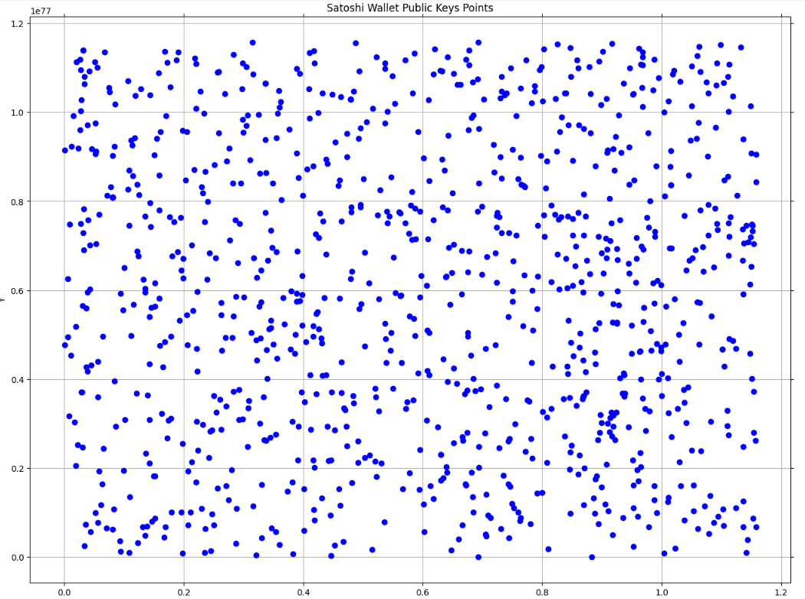

# Satoshi Wallets

## GetBlocksData.py:
This application enables the extraction of wallet addresses and public keys from Bitcoin blocks, listing them as text.
The application has already been executed for the first 33,000 blocks, and the corresponding data is available in the "Data" directory as Excel files.

## SatoshiWalletPublicKeysPoints.py:
This application reads the x and y coordinates of public keys from a CSV file and visualizes them.
An example output is shown below.

